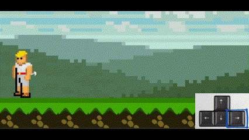

Incarnez Hermès, le messager des dieux dans une épopée fantastique à la conquête de l'Olympe ! Votre but est de vous imposer comme le douzième dieu de l'Olympe devant Zeus lui-même. Mais pour y arriver, vous devrez vous montrer rusé afin d’éviter les dangers, récupérer les différentes parties de votre trône et le forger. Entre les paysages fabuleux mais dangereux, les monstres, les marchés avec les dieux et le courroux d'Héra, arriverez-vous à conquérir l'Olympe ?  

Tutoriel
---------------
### Les game over 
Attention voyageur, les moires vous observent et elles sont de votre coté. Elles vous laisseront recommencer le niveau si vous êtes assez maladroit pour tomber ou vous noyer, mais les monstres sont leurs créations. Si vous vous faites toucher par eux, vous perdrez une vie que chacune vous a offerte avant votre départ. 3 vies pour 3 moires. Si vous perdez ces 3 vies alors elles penseront que vous n'avez pas l'étoffe d'un vrai dieux et vous forceront à recommencer le jeux entier pour prouver votre vraie valeur. 
Est-ce que vous serez assez fort pour survivre à ce périple ?

### Les déplacements
Le niveau s'achève lorsque vous atteignez le drapeau rouge. Comme un platformer classique, il faut vous déplacer
vers la droite. Appuyez sur la flèche de droite pour que Hermès se déplace à droite.

Si jamais vous loupez quelque chose, vous pouvez partir en arrière. Appuyez sur la flèche de gauche pour 
qu'Hermès parte à gauche.

Sur votre chemin vous allez rencontrer des obstacles et ennemis. En tant que Hermès, vous ne vous battez pas, faîtes preuve
de ruse et éviter les !
Appuyez sur la touche espace pour sauter.

### Les objets 
Tout au long de votre odyssée vous pouvez ramasser des objets. Pour cela il vous suffit juste de passer sur cet objet et il sera récupéré automatiquement. Mais faites attention jeune voyageur, vous n'avez pas un grand sac à dos, il ne peux acceuilir qu'un seul objet à la fois, et l'ancient objet est perdu à jamais dans le néan. 

Installation et démarrage
---------------
### Conditions préalables  
* Télécharger la librairie pygame
* Télécharger le dossier gitHub complet
* Activer le son pour une meilleure expérience
* Lancer le fichier mainCode.py se trouvant dans le dossier code/global
* Pofiter de votre incroyable aventure !

Dévelopeuses 
---------------
Deux étudiantes très motivées et passionnées d'informatique :
* Morgane Farez 
* Cassiopée Gossin

#### Designs : 
* Cassiopée Gossin
* https://opengameart.org/

