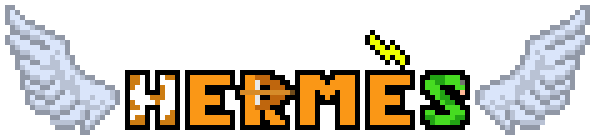

Step into the shoes of Hermes, messenger of the gods in this fantastic conquest of the Olympus ! Your goal is to 
establish yourself as the twelfth god of Olympus and face Zeus himself. To succeed you will have to be cunning in order
to avoid danger, collect parts of your throne and forge it. Among fabulous but dangerous landscapes, monsters, deals with the 
gods and the wrath of Hera, will you be able to conquer Olympus ?

Getting started
---------------
### Prerequisites  

* Download a python editor
* Download the pygame library
* Download the whole gitHub folder
* Sound on for a better experience
* Enjoy this fantastic adventure !

### Launch of the game
Open with your python editor the code/global_niveau/mainCode.py file.
Run the file and your quest begins.

Tutorial
---------------
### Les game over

To end a level, you need to reach the red flag. In order to do that, you have to go toward the right of the window.
Press the right arrow on your keyboard to make Hermes move to the right.

If you missed something, you can always go back in the level.
Press the left arrow on your keyboard to make Hermes move to the left.

You may encounter obstacles or enemies. As Hermes, you are not a fighter, to avoid them you just have to jump over them.
Press the up arrow or the space key to jump.

### Items
Throughout your odyssey you will be able to collect items. All you have to do is to pass over the item and it will be
automatically picked up. However be careful young traveller your backpack is small and can hold one item at the
time, the old one will be lost forever in the void. Pay attention to all your conversations, so you don't miss any
clues.

### Game overs
Traveller beware the Fates are watching you, and they're on your side. They will let you retry the level if you're 
clumsy enough to fall or drown, but the monsters are their creations. If you are touched by one of them, you will lose a life 
that each of the Fates gave you at the beginning of your quest. 3 lives for 3 Fates. If you lose these 3 lives, they'll 
think you're not godlike enough and will make you start all over again to prove your true worth. Will you be strong 
enough to survive the journey ?

Developers 
---------------
Two very motivated students passionate about computer science : 
* Morgane Farez 
* Cassiopée Gossin

#### Designs : 
* Cassiopée Gossin
* https://opengameart.org/

